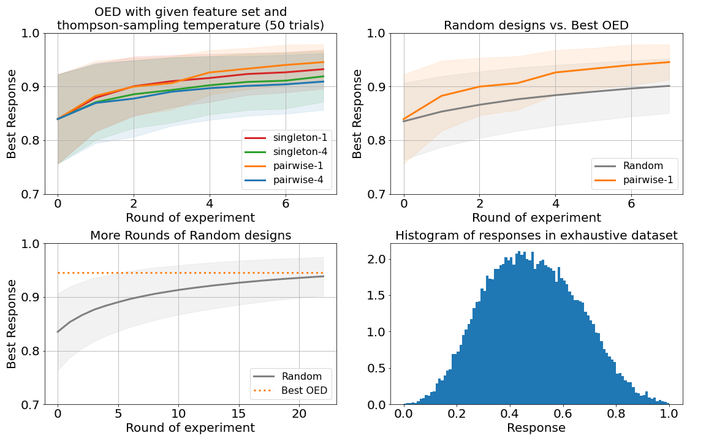

[](https://github.com/broadinstitute/pyroed/actions)
[](https://broadinstitute.github.io/pyroed/)

# Bayesian optimization of discrete sequences

Pyroed is a framework for model-based optimization of sequences of discrete
choices with constraints among choices.
Pyroed aims to address the regime where there is very little data (100-10000
observations), small batch size (say 10-100), short sequences (length 2-100) of
heterogeneous choice sets, and possibly with constraints among choices at
different positions in the sequence.

Under the hood, Pyroed performs Thompson sampling against a Bayesian linear
regression model that is automatically generated from a Pyroed problem
specification, deferring to [Pyro](https://pyro.ai) for Bayesian inference
(either variational or mcmc) and to annealed Gibbs sampling for discrete
optimization.
All numerics is performed by [PyTorch](https://pytorch.org).

## Installing

You can install directly from github via
```sh
pip install https://github.com/broadinstitute/pyroed/archive/main.zip
```
For developing Pyroed you can install from source
```sh
git clone git@github.com:broadinstitute/pyroed
cd pyroed
pip install -e .
```

## Quick Start

### 1. Specify your problem in the Pyroed language

First specify your sequence space by declaring a `SCHEMA`, `CONSTRAINTS`, `FEATURE_BLOCKS`, and `GIBBS_BLOCKS`. These are all simple Python data structures.
For example to optimize a nucleotide sequence of length 6:
```python
# Declare the set of choices and the values each choice can take.
SCHEMA = OrderedDict()
SCHEMA["nuc0"] = ["A", "C", "G", "T"]  # these are the same, but
SCHEMA["nuc1"] = ["A", "C", "G", "T"]  # you can make each list different
SCHEMA["nuc2"] = ["A", "C", "G", "T"]
SCHEMA["nuc3"] = ["A", "C", "G", "T"]
SCHEMA["nuc4"] = ["A", "C", "G", "T"]
SCHEMA["nuc5"] = ["A", "C", "G", "T"]

# Declare some constraints. See pyroed.constraints for options.
CONSTRAINTS = []
CONSTRAINTS.append(AllDifferent("nuc0", "nuc1", "nuc2"))
CONSTRAINTS.append(Iff(TakesValue("nuc4", "T"), TakesValue("nuc5", "T")))

# Specify groups of cross features for the Bayesian linear regression model.
FEATURE_BLOCKS = []
FEATURE_BLOCKS.append(["nuc0"])  # single features
FEATURE_BLOCKS.append(["nuc1"])
FEATURE_BLOCKS.append(["nuc2"])
FEATURE_BLOCKS.append(["nuc3"])
FEATURE_BLOCKS.append(["nuc4"])
FEATURE_BLOCKS.append(["nuc5"])
FEATURE_BLOCKS.append(["nuc0", "nuc1"])  # consecutive pairs
FEATURE_BLOCKS.append(["nuc1", "nuc2"])
FEATURE_BLOCKS.append(["nuc2", "nuc3"])
FEATURE_BLOCKS.append(["nuc3", "nuc4"])
FEATURE_BLOCKS.append(["nuc4", "nuc5"])

# Finally define Gibbs sampling blocks for the discrete optimization.
GIBBS_BLOCKS = []
GIBBS_BLOCKS.append(["nuc0", "nuc1"])  # consecutive pairs
GIBBS_BLOCKS.append(["nuc1", "nuc2"])
GIBBS_BLOCKS.append(["nuc2", "nuc3"])
GIBBS_BLOCKS.append(["nuc3", "nuc4"])
GIBBS_BLOCKS.append(["nuc4", "nuc5"])
```

### 2. Declare your initial experiment

An experiment consists of a set of `sequences` and the experimentally measured
`responses` of those sequences.
```python
# Enter your existing data.
sequences = ["ACGAAA", "ACGATT", "AGTTTT"]
responses = torch.tensor([0.1, 0.2, 0.6])

# Collect these into a dictionary that we'll maintain throughout our workflow.
design = pyroed.encode_design(SCHEMA, sequences)
experiment = pyroed.start_experiment(SCHEMA, design, responses)
```

### 3. Iteratively create new designs

At each step of our optimization loop, we'll query Pyroed for a new design.
Pyroed choose the design to balance exploitation (finding sequences with high
response) and exploration.
```python
design = pyroed.get_next_design(
    SCHEMA, CONSTRAINTS, FEATURE_BLOCKS, GIBBS_BLOCKS, experiment, design_size=3
)
new_seqences = ["".join(s) for s in pyroed.decode_design(SCHEMA, design)]
print(new_sequences)
# ["CAGTGC", "GCAGTT", "TAGGTT"]
```
Then we'll go to the lab, measure the responses of these new sequences, and
append the new results to our experiment:
```python
new_responses = torch.tensor([0.04, 0.3, 0.25])
experiment = pyroed.update_experiment(SCHEMA, experiment, design, new_responses)
```
We repeat step 3 as long as we like.


## Demo: Semi-Synthetic Experiment 

For a more in-depth demonstration of Pyroed usage in practice on some transcription factor data
see [`rollout_tf8.py`](https://github.com/broadinstitute/pyroed/blob/main/examples/rollout_tf8.py)
and [`tf8_demo.ipynb`](https://github.com/broadinstitute/pyroed/blob/main/examples/tf8_demo.ipynb).


